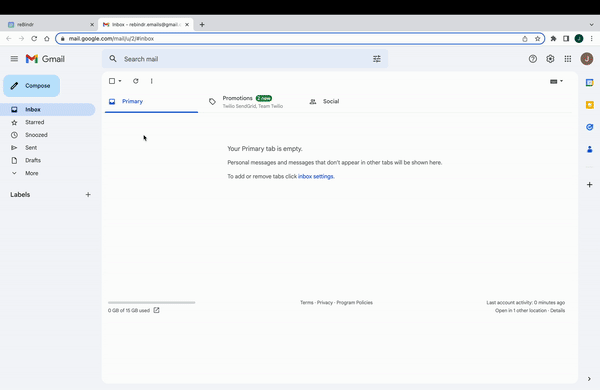

# reBindr

## Background

[reBindr](http://rebindr.onrender.com/) is a web application that helps you set up and manage reminders for tasks and events. It offers a quick and easy way to create notifications, and allows you to include others in your reminders. You can also upload information and links related to your devices and tasks. With reBindr, you can stay organized and on top of the things that matter in your life.

## Technologies

* MongoDB
* Mongoose
* ExpressJS
* React-Redux
* NodeJs

* Miro for wire frames
* Figma for frontend design
* Big Calendar Library
* Twilio REST API for SMS messaging
* SendGrid Email API for email messaging

## Features

### Seamless Email/Text scheduling upon creating a reminder notification or sharing a reminder

### Splash page with tutorial

* GIF of Ming's Intro before login

## Code Snippets

### Sharing a reminder notification via email and/or text

`js
router.post('/:id/shareReminder', requireUser, async (req, res, next) => {
    const reminder = await Reminder.findById(req.params.id)
    // reminder = await reminder.populate('item', '_id, name');
    console.log(req.body)
    let item = await Inventory.findById(reminder.item)

    if (!reminder || !item) return res.json(null)

    const shareEmail = req.body.email
    const shareText = req.body.phone

    const sendDate = parseInt(Math.floor(new Date(`${reminder.date}`).getTime() / 1000))
    const msgBody = 
    `   
        Hey ${req.user.username}!
        This is a reBindr reminder to ${reminder.title} for your ${item.name}. This is due ${reminder.date}!  
        ${item.model ? 'Model #: ' + item.model + '.' : ''} 
        ${item.notes ? 'Notes: ' + item.notes + '.' : ''} 
        ${item.user_manual ? 'User Manual: ' + item.user_manual + '.' : ''} 
        ${item.consumables.map(consumable => consumable.consumable_name + ': ' + consumable.link)} 
    }`
    if (shareEmail) {
        const emailMsg = {
            to: shareEmail, // Change to your recipient
            from: 'reBindr.emails@gmail.com', // Change to your verified sender
            subject: reminder.title,
            text: msgBody,
        }      
        // send_at: sendDate
        sendMailer(emailMsg)    
    }
    
    if (shareText) {
        const textMsg = {
            messagingServiceSid: messageSid,
            body: msgBody,
            to: shareText,
            from: '218-522-9665 ',
        }
        sendText(textMsg)
    }
    return res.json(reminder)
})
`
